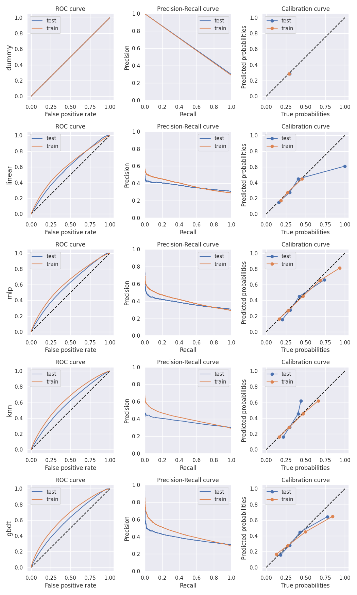
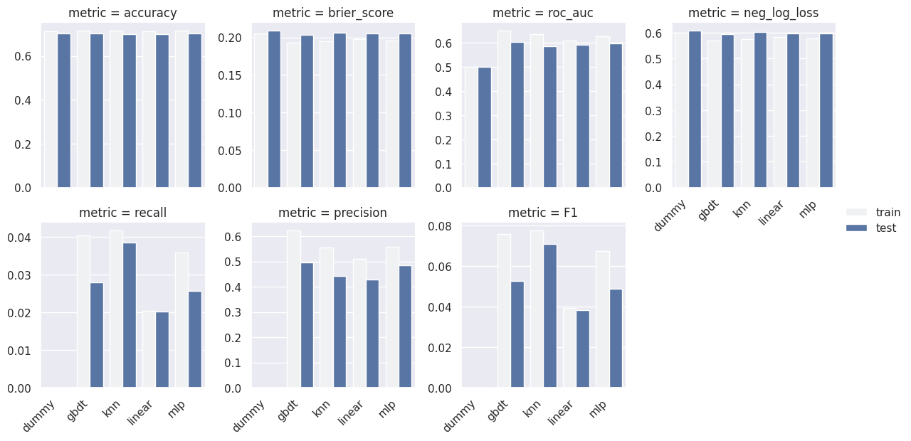

# Crash Prediction

This project aims at predicting car crash severity in New Zealand, using
publicly available data from NZTA.


## Installation

First make sure you have [Git](https://git-scm.com/downloads),
[Miniconda](https://docs.conda.io/en/latest/miniconda.html) and `make` installed
on your computer.

Then open a terminal and clone this repository:
```
git clone https://github.com/neon-ninja/crash_prediction.git
```
Use `make` to create a conda environment and install all dependencies:
```
cd crash_prediction
make venv
```
The conda environment is created in the local `venv` folder.

**Note:** If you are on [NeSI](https://www.nesi.org.nz/) HPCs, use
`make venv_nesi` instead.

Now you can run the provided notebooks using the `crash_prediction` kernel, or
use the scripts detailed in the next section.


## Getting Started

You can either use the following scripts or run the full pipeline using
[Snakemake](https://snakemake.readthedocs.io) (more details below):

- the `cas_data` script is used to download and preprocess CAS data,
- the `models` script is used to fit a model and make predictions,
- the `evaluate` script generate summary tables and plots.

Before using any script or Snakemake, make sure that you activate the conda
environment:
```
cd crash_prediction
conda activate ./venv
```

If you want to use the scripts, first you need to retrieve the CAS dataset,
using the `cas_data` script:
```
mkdir data
cas_data download data/cas_dataset.csv
```

Then prepare the dataset, i.e. select relevant colums, filter NaN values, etc.:
```
mkdir results
cas_data prepare data/cas_dataset.csv -o results/cas_dataset.csv
```

Use the `models` script to fit a model, here a k-nearest neighbors model:
```
models fit results/cas_dataset.csv results/knn_model/model.pickle --model-type knn
```
and make predictions using the fitted model:
```
models predict results/cas_dataset.csv results/knn_model/model.pickle results/knn_model/predictions.csv
```

Once you have trained one or more models, you can create some performance plots
with the `evaluate` script:
```
evaluate results/summary results/cas_dataset.csv results/knn_model/predictions.csv --labels knn
```

Predictions can be visualized on a map using the `visualize` script:
```
visualize results/cas_dataset.csv results/*_model/predictions.csv
```

For each script, you can use the `-h` or `--help` flag to get detailed
explanations about the options. For example:
```
model fit -h
```

**Note:** When fitting a model, hyperparameters are automatically set using various 
strategies depending on the model (random search, grid search, ...) that can
benefit from parallelisation. Change the `--n-workers` parameter to run
`models fit` on multiple processes. If you are running the code on the HPC, you
can also use `--use-slurm` flag to distribute computations on multiple nodes.


## Full pipeline with Snakemake

You can run all previous steps (data preparation, model fitting, predictions
and evaluation) in a coordinated way using Snakemake:
```
snakemake -j <cores>
```
where `<cores>` stands for the number of CPU cores to use for the workflow.

There are a couple of interesting options to be aware of to make your life easier:

- use `-n` to see what will be (re-)computed without actually running anything,
- use `-p` to print the command line associated with each step
- use `-k` to continue running the workflow even if one target failed.

If you are using the HPC and want to make use of the Slurm backend for parallel
model fitting, use `--config USE_SLURM=True`:
```
snakemake -j 1 --config USE_SLURM=True
```

For testing purpose, you can also reduce the number of iterations of
hyperparameters optimization via the `N_ITER` configuration:
```
snakemake -j 1 --config N_ITER=1
```

## Results

Performance plots for the latest run are available in the [results/summary](results/summary)
folder:




These scores can also be downloaded as [a .csv file](results/summary/scores.csv).

The classifiers being probabilistic, one should particularly pay attention to
the calibration curves to ensure that the prediction has a good coverage.


## Notebooks

Notebooks have been used for exploratory work:

- [01_explore_cas.ipynb](notebooks/01_explore_cas.ipynb)
  [[html version](https://neon-ninja.github.io/crash_prediction/notebooks/01_explore_cas.html)]
  is an exploratory data analysis of the CAS dataset ,
- [02_crash_severity.ipynb](notebooks/02_crash_severity.ipynb)
  [[html version](https://neon-ninja.github.io/crash_prediction/notebooks/02_crash_severity.html)]
  focuses on the severity of the crashes.

*Note: the notebooks have been written as Python scripts and converted into
notebooks using [`Jupytext`](https://github.com/mwouts/jupytext).*


## License

This project is published under the MIT License. See the [LICENSE](LICENSE) file
for details.


## Contact

If you have any question or comment on this work, do not hesitate to contact us:

- Nick Young (nick.young@auckland.ac.nz) from the [Center for eResearch](https://www.eresearch.auckland.ac.nz/),
- Maxime Rio (maxime.rio@nesi.org.nz) from [NeSI](https://www.nesi.org.nz/).
